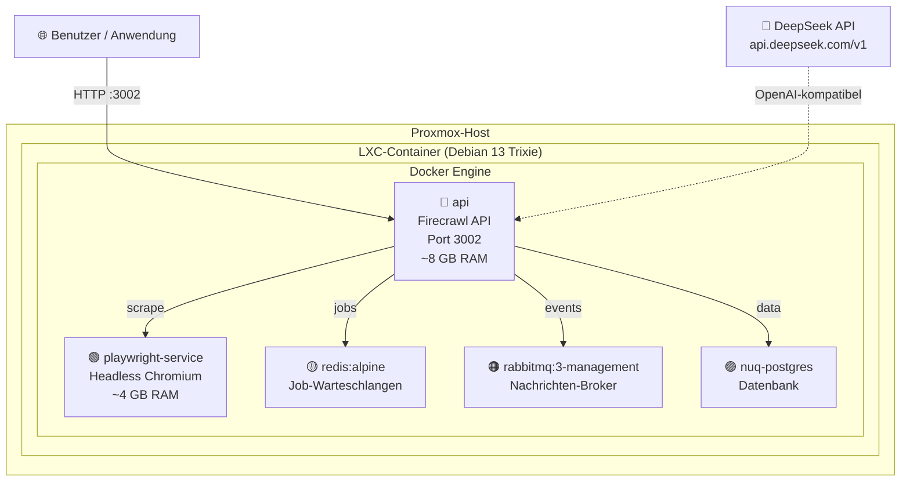

<p align="center">
  
</p>

<p align="center">
  <!-- Badges -->
  <a href="LICENSE"></a>
  
  
  
  
  <a href="https://github.com/rezurmas/firecrawl-proxmox/stargazers"></a>
  <a href="https://github.com/rezurmas/firecrawl-proxmox/network/members"></a>
  
</p>

<p align="center">
  <b>🇩🇪 Deutsch</b> &nbsp;|&nbsp;
  <a href="README.md">🇵🇱 Polski/English (zweisprachig)</a> &nbsp;|&nbsp;
  <a href="README.en.md">🇬🇧 English</a>
</p>

<br />

> **🔥 Keine Kompilierung. Ein Skript. 5 Minuten bis zur laufenden Instanz.**

Ein vollständiges Toolkit für die Bereitstellung einer **selbst gehosteten** [Firecrawl](https://github.com/firecrawl/firecrawl)-Instanz auf einem **Proxmox LXC-Container** mit **Debian 13 Trixie**, **Docker** und der **DeepSeek API** als KI-Engine.

---

## 🚀 Schnellstart

> **Für Experten —** TL;DR: Befehle ohne Kommentar. Falls etwas schiefgeht, scrollen Sie nach unten zur [vollständigen Installationsanleitung](#-vollständige-installationsanleitung).

```bash
# ─── Auf dem Proxmox-Host ────────────────────────────────────────
# 1. LXC-Container erstellen (Details: lxc-setup.md)
#    🔑 WICHTIG: features: keyctl=1,nesting=1 (ohne dies funktioniert Docker nicht!)
pct set <CTID> -features keyctl=1,nesting=1

# ─── Im Container ─────────────────────────────────────────────────
# 2. Paket herunterladen
git clone https://github.com/rezurmas/firecrawl-proxmox.git
cd firecrawl-proxmox

# 3. Auto-Installer ausführen (mit DeepSeek-Schlüssel — volle KI-Funktionalität)
chmod +x install.sh
DEEPSEEK_API_KEY="sk-ihr-api-schlüssel" ./install.sh

# 4. Prüfen, ob es funktioniert
./check.sh
curl http://localhost:3002/v1/health
```

---

## 📖 Inhaltsverzeichnis

- [🚀 Schnellstart](#-schnellstart)
- [🎯 Was ist Firecrawl?](#-was-ist-firecrawl)
- [🏗️ Architektur](#️-architektur)
- [📋 Anforderungen](#-anforderungen)
- [📦 Was ist enthalten?](#-was-ist-enthalten)
- [🔧 Vollständige Installationsanleitung](#-vollständige-installationsanleitung)
- [🧠 LLM-Konfiguration](#-llm-konfiguration)
- [🌐 API-Referenz](#-api-referenz)
- [📊 Verwaltungsbefehle](#-verwaltungsbefehle)
- [🐛 Fehlerbehebung](#-fehlerbehebung)
- [🔐 Sicherheitsempfehlungen](#-sicherheitsempfehlungen)
- [🔄 Aktualisierung](#-aktualisierung)
- [🌍 GitHub Pages](#-github-pages)
- [📚 Ressourcen & Links](#-ressourcen--links)
- [📜 Lizenz](#-lizenz)

---

## 🎯 Was ist Firecrawl?

**[Firecrawl](https://firecrawl.dev)** ist ein leistungsstarkes Open-Source-Tool für Web Scraping, das jede Webseite in saubere, strukturierte Markdown- oder JSON-Daten umwandelt — ideal für die Versorgung von KI-Modellen (LLMs), Agenten und Daten-Pipelines.

**Warum Self-Hosting auf Proxmox?**

| Vorteil | Beschreibung |
|---|---|
| 🔒 **Datenschutz** | Ihre Daten verlassen niemals Ihre Infrastruktur |
| 💰 **Keine API-Limits** | Keine monatlichen Abonnements — unbegrenztes Scraping |
| ⚡ **Niedrige Latenz** | API in Ihrem lokalen Netzwerk — <5ms Latenz |
| 🧠 **Ihr eigenes LLM** | DeepSeek, OpenAI, Ollama — Sie haben die Wahl |
| 🎛️ **Volle Kontrolle** | Konfiguration, Monitoring, Backup — alles unter Ihrer Kontrolle |

---

## 🏗️ Architektur



**5 Docker-Container** innerhalb eines einzigen LXC:

<table>
<tr>
  <th>Dienst</th>
  <th>Image</th>
  <th>RAM</th>
  <th>Rolle</th>
</tr>
<tr>
  <td><code>api</code></td>
  <td><code>ghcr.io/firecrawl/firecrawl</code></td>
  <td>~8 GB</td>
  <td>Kernlogik, REST API, Worker</td>
</tr>
<tr>
  <td><code>playwright-service</code></td>
  <td><code>ghcr.io/firecrawl/playwright-service</code></td>
  <td>~4 GB</td>
  <td>Headless Chromium für JS-Rendering</td>
</tr>
<tr>
  <td><code>redis</code></td>
  <td><code>redis:alpine</code></td>
  <td>~100 MB</td>
  <td>BullMQ Job-Warteschlangen</td>
</tr>
<tr>
  <td><code>rabbitmq</code></td>
  <td><code>rabbitmq:3-management</code></td>
  <td>~500 MB</td>
  <td>Nachrichten-Broker zwischen Diensten</td>
</tr>
<tr>
  <td><code>nuq-postgres</code></td>
  <td><code>ghcr.io/firecrawl/nuq-postgres</code></td>
  <td>~200 MB</td>
  <td>Persistente Datenspeicherung</td>
</tr>
</table>

> 💡 Wir verwenden vorgefertigte Images aus der **GitHub Container Registry (ghcr.io)** — keine lokale Kompilierung erforderlich!

---

## 📋 Anforderungen

<table>
<tr>
  <th>Komponente</th>
  <th align="center">Minimum</th>
  <th align="center">Empfohlen</th>
</tr>
<tr>
  <td>CPU</td>
  <td align="center">4 Kerne</td>
  <td align="center">8 Kerne</td>
</tr>
<tr>
  <td>RAM</td>
  <td align="center">8 GB</td>
  <td align="center">16 GB</td>
</tr>
<tr>
  <td>Speicher</td>
  <td align="center">60 GB</td>
  <td align="center">100 GB+ SSD</td>
</tr>
<tr>
  <td>Swap</td>
  <td align="center">2 GB</td>
  <td align="center">4 GB</td>
</tr>
<tr>
  <td>Proxmox VE</td>
  <td align="center">7.x+</td>
  <td align="center">8.x+</td>
</tr>
<tr>
  <td>Vorlage (Template)</td>
  <td colspan="2" align="center">Debian 13 Trixie</td>
</tr>
</table>

> ⚠️ **Warum so viel RAM?** Playwright (Chromium) benötigt ~2–4 GB allein für den Browser, die API mit Workern ~4–6 GB, die übrigen Dienste ~2 GB. Mit 8 GB läuft alles, aber ohne Reserve. Wenn Sie intensives Crawling planen — weisen Sie 16 GB zu.

---

## 📦 Was ist enthalten?

```
firecrawl-proxmox/
├── 📖 README.md                          ← Diese Datei (Sie sind hier!)
├── 🚀 install.sh                         ← AUTO-INSTALLER — führen Sie nur dies aus!
├── 🔍 check.sh                           ← Health-Check-Skript
├── 🖥️ lxc-setup.md                       ← Anleitung zur LXC-Container-Einrichtung
├── ⚙️ .env.example                       ← Konfigurationsvorlage
├── 🐳 docker-compose.override.yaml       ← Build → Image-Override (keine Kompilierung!)
├── 🔧 firecrawl.service                  ← systemd-Dienst für Autostart
└── 🙈 .gitignore                         ← Git-Ausschlüsse
```

---

## 🔧 Vollständige Installationsanleitung

### Schritt 0: Vorbereitung des LXC-Containers auf Proxmox

Detaillierte Anweisungen mit GUI und CLI finden Sie in der Datei **[lxc-setup.md](lxc-setup.md)**.

<details>
<summary><b>📖 Ausklappen — Kurzzusammenfassung</b></summary>

<br />

**Über die Proxmox-GUI:**

| Registerkarte | Einstellung | Wert |
|---|---|---|
| **General** | CT ID | Beliebige freie ID, z. B. `152` |
| | Hostname | `firecrawl` |
| | Unprivileged | ✅ **AKTIVIERT** |
| **Template** | Template | `debian-13-trixie-standard` |
| **Disks** | Root disk | Min. **60 GB** |
| **CPU** | Cores | Min. **4** |
| **Memory** | Memory | Min. **8192 MB** |
| | Swap | Min. **2048 MB** |
| **Network** | IPv4/CIDR | Entsprechend Ihrer Netzwerkkonfiguration |

**Nach der Container-Erstellung — UNBEDINGT!:**

```bash
# Auf dem Proxmox-Host — Nesting + Keyctl hinzufügen
pct set <CTID> -features keyctl=1,nesting=1
pct start <CTID>
pct enter <CTID>
```

> 🔑 **Ohne `keyctl=1,nesting=1` wird Docker NICHT im LXC-Container starten!**

**Überprüfung vor der Installation:**

```bash
# Funktioniert Nesting? (sollte eine Dateiliste zeigen, NICHT "Permission denied")
ls /proc/sys/net/ipv4/ | head -5

# Funktioniert Keyctl? (sollte eine Schlüsselliste zeigen, auch wenn leer)
cat /proc/keys

# Besteht Internetzugang?
ping -c 1 google.com

# Wie viel RAM?
free -h
```

</details>

---

### Schritt 1: Herunterladen und Ausführen des Auto-Installers

```bash
# Repository klonen
git clone https://github.com/rezurmas/firecrawl-proxmox.git
cd firecrawl-proxmox
chmod +x install.sh

# Option A: Mit DeepSeek-Schlüssel (volle KI-Funktionalität)
export DEEPSEEK_API_KEY="sk-ihr-api-schlüssel"
./install.sh

# Option B: Ohne API-Schlüssel (nur grundlegendes Scrape/Crawl)
./install.sh
```

<details>
<summary><b>📖 Was genau macht <code>install.sh</code>?</b></summary>

<br />

Das Skript führt **7 Schritte** automatisch aus:

| Schritt | Beschreibung |
|---|---|
| **1/7** | Installiert Systemabhängigkeiten (`curl`, `git`, `ca-certificates`, usw.) |
| **2/7** | Installiert Docker + Docker Compose **mit der korrekten Methode für Debian 13** (`.asc` + `.sources` DEB822) |
| **3/7** | Klont Firecrawl von GitHub nach `/opt/firecrawl` |
| **4/7** | Erstellt `.env` mit generierten Passwörtern und DeepSeek-Konfiguration |
| **5/7** | Überschreibt `docker-compose.yaml` — ersetzt `build:` durch `image:` (vorgefertigte GHCR-Images!) |
| **6/7** | Lädt Docker-Images herunter und startet alle 5 Container |
| **7/7** | Erstellt und aktiviert einen `systemd`-Dienst für den Autostart beim Neustart |

</details>

---

### Schritt 2: Überprüfung

```bash
# Führen Sie das Check-Skript aus — führt ein vollständiges Status-Audit durch
chmod +x check.sh && ./check.sh
```

Das `check.sh`-Skript überprüft:
- ✅ System (OS, RAM, Speicher, LXC-Nesting)
- ✅ Docker (Version, Daemon, Compose)
- ✅ Alle 5 Container
- ✅ API — `/v1/health` + `/v1/scrape`
- ✅ `.env`-Konfiguration (Schlüssel, Passwörter)

Oder manuell:

```bash
# Container überprüfen
docker compose -f /opt/firecrawl/docker-compose.yaml ps

# API testen
curl http://localhost:3002/v1/health
```

---

### Schritt 3: Zugriff

- **API:** `http://<IP>:3002`
- **Bull Queue UI:** `http://<IP>:3002/admin/<BULL_AUTH_KEY>/queues`

> 💡 **Wie findet man die Container-IP?** Führen Sie im Container aus: `ip -4 addr show eth0 | grep -oP 'inet \K[\d.]+'`

---

## 🧠 LLM-Konfiguration

Firecrawl verwendet eine OpenAI-kompatible API. **DeepSeek unterstützt dieses Format vollständig!**

### DeepSeek API (Standard)

| Einstellung | Wert | Hinweise |
|---|---|---|
| `OPENAI_BASE_URL` | `https://api.deepseek.com/v1` | DeepSeek-Endpunkt |
| `OPENAI_API_KEY` | `sk-ihr-schlüssel` | Schlüssel von [platform.deepseek.com](https://platform.deepseek.com) |
| `MODEL_NAME` | `deepseek-chat` | Standardmodell |
| `MODEL_EMBEDDING_NAME` | *leer* | ⚠️ DeepSeek hat keine Embeddings! |

**Was mit DeepSeek funktioniert (unterstützt):**
- ✅ `/v1/scrape` mit `formats: ["json"]` — strukturierte Datenextraktion
- ✅ `/v1/scrape` mit `onlyMainContent: true` — Extraktion des Hauptinhalts
- ✅ `/v1/extract` — KI-gestützte Datenextraktion aus Seiten
- ✅ Grundlegendes Scrape, Crawl, Map, Search

**Was mit DeepSeek fehlt (nicht unterstützt):**
- ❌ Einige erweiterte Funktionen, die Embeddings erfordern — erwägen Sie OpenAI oder Ollama

<details>
<summary><b>🔀 Alternative LLM-Engines</b></summary>

<br />

### OpenAI (volle Embedding-Unterstützung)

```ini
OPENAI_BASE_URL=https://api.openai.com/v1
OPENAI_API_KEY=sk-ihr-openai-schlüssel
MODEL_NAME=gpt-4o
MODEL_EMBEDDING_NAME=text-embedding-3-small
```

### Lokales Ollama (kostenlos, lokal)

```ini
OLLAMA_BASE_URL=http://host.docker.internal:11434/api
MODEL_NAME=llama3.1:8b
MODEL_EMBEDDING_NAME=nomic-embed-text
```

> 💡 Ollama muss auf dem LXC-Host installiert sein. Herunterladen von [ollama.com](https://ollama.com).

</details>

---

## 🌐 API-Referenz

Vollständige Dokumentation: [docs.firecrawl.dev](https://docs.firecrawl.dev)

> 🔁 Ersetzen Sie `<IP>` durch die IP-Adresse Ihres LXC-Containers.

```bash
# ─── Health Check ─────────────────────────────────────────────────
curl http://<IP>:3002/v1/health
```

```bash
# ─── Scrape (Seiteninhalt abrufen) ─────────────────────────────────
curl -X POST http://<IP>:3002/v1/scrape \
  -H 'Content-Type: application/json' \
  -d '{
    "url": "https://example.com",
    "formats": ["markdown", "html"]
  }'
```

```bash
# ─── Crawl (alle Unterseiten crawlen) ──────────────────────────────
curl -X POST http://<IP>:3002/v2/crawl \
  -H 'Content-Type: application/json' \
  -d '{
    "url": "https://docs.firecrawl.dev",
    "limit": 50
  }'
```

```bash
# ─── Map (alle URLs auf einer Seite entdecken) ────────────────────
curl -X POST http://<IP>:3002/v2/map \
  -H 'Content-Type: application/json' \
  -d '{"url": "https://firecrawl.dev"}'
```

```bash
# ─── Extract (KI-gestützte Extraktion) ────────────────────────────
curl -X POST http://<IP>:3002/v1/extract \
  -H 'Content-Type: application/json' \
  -d '{
    "urls": ["https://example.com"],
    "prompt": "Extrahiere die Hauptüberschrift und alle Links"
  }'
```

```bash
# ─── Search (erfordert SearXNG) ────────────────────────────────────
curl -X POST http://<IP>:3002/v1/search \
  -H 'Content-Type: application/json' \
  -d '{"query": "firecrawl web scraping", "limit": 5}'
```

---

## 📊 Verwaltungsbefehle

### Docker Compose

```bash
# Status aller Container
docker compose -f /opt/firecrawl/docker-compose.yaml ps

# Live-Logs
docker compose -f /opt/firecrawl/docker-compose.yaml logs -f api

# Einzelnen Dienst neustarten
docker compose -f /opt/firecrawl/docker-compose.yaml restart playwright-service

# Alles stoppen
cd /opt/firecrawl && docker compose down

# Alles starten
cd /opt/firecrawl && docker compose up -d
```

### Systemd

```bash
# Dienststatus prüfen
systemctl status firecrawl

# Dienst-Logs
journalctl -u firecrawl -f

# Alles neustarten
systemctl restart firecrawl

# Stoppen
systemctl stop firecrawl

# Autostart deaktivieren
systemctl disable firecrawl

# Autostart aktivieren
systemctl enable firecrawl
```

### Datenbank-Backup

```bash
# PostgreSQL-Datenbank exportieren
docker compose -f /opt/firecrawl/docker-compose.yaml \
  exec nuq-postgres pg_dump -U firecrawl firecrawl \
  > "firecrawl_backup_$(date +%Y%m%d_%H%M%S).sql"
```

---

## 🐛 Fehlerbehebung

<details>
<summary><b>🔍 Vollständige Fehlertabelle ausklappen</b></summary>

<br />

<table>
<tr>
  <th>Problem</th>
  <th>Ursache</th>
  <th>Lösung</th>
</tr>
<tr>
  <td><code>apt update</code>: <code>sqv</code>-Fehler</td>
  <td>Debian 13 erfordert <code>.asc</code> + <code>.sources</code></td>
  <td>Verwenden Sie <code>install.sh</code> — es verwendet die korrekte Methode</td>
</tr>
<tr>
  <td>Docker: <code>Operation not permitted</code></td>
  <td>Fehlendes <code>keyctl=1,nesting=1</code> im LXC</td>
  <td><code>pct set &lt;CTID&gt; -features keyctl=1,nesting=1</code></td>
</tr>
<tr>
  <td>API: Verbindungsaufbau abgelehnt</td>
  <td>API hört nicht zu</td>
  <td><code>docker compose ps</code>, Logs prüfen: <code>docker compose logs api</code></td>
</tr>
<tr>
  <td>Playwright-Timeout</td>
  <td>Nicht genug RAM</td>
  <td>RAM auf 12+ GB erhöhen</td>
</tr>
<tr>
  <td>OOM-Killer beendet Container</td>
  <td>RAM wird knapp</td>
  <td>RAM erhöhen, <code>MAX_RAM=0.6</code> reduzieren</td>
</tr>
<tr>
  <td>RabbitMQ startet nicht</td>
  <td>Healthcheck braucht mehr Zeit</td>
  <td><code>docker compose logs rabbitmq</code>, länger warten</td>
</tr>
<tr>
  <td>„Supabase client is not configured"</td>
  <td><b>Normal bei Self-Hosted!</b></td>
  <td>Ignorieren — Self-Hosted hat kein Supabase</td>
</tr>
<tr>
  <td>ghcr.io Rate-Limit</td>
  <td>GitHub-Limit für anonyme Pulls</td>
  <td><code>echo "TOKEN" | docker login ghcr.io -u USER --password-stdin</code></td>
</tr>
<tr>
  <td>Kein <code>debian-13</code> in den Vorlagen</td>
  <td>Veraltete Liste</td>
  <td><code>pveam update</code> auf dem Proxmox-Host</td>
</tr>
<tr>
  <td><code>/proc/keys</code>: Permission denied</td>
  <td>Fehlendes <code>keyctl=1</code></td>
  <td><code>keyctl=1</code> zu den LXC-Features hinzufügen</td>
</tr>
<tr>
  <td>API funktioniert lokal, aber nicht remote</td>
  <td>Firewall / Routing</td>
  <td><code>iptables</code>, Proxmox-Firewall-Regeln prüfen</td>
</tr>
<tr>
  <td>Speicher voll</td>
  <td>Docker-Logs / Daten</td>
  <td><code>docker system prune -a</code> (vorsichtig!)</td>
</tr>
</table>

</details>

### ⚡ Schnelle Lösungen für häufige Probleme

**Docker lässt sich nicht installieren — `sqv` / `docker.gpg`-Fehler:**

> Debian 13 Trixie verwendet den neuen `sqv`-Prüfer anstelle von `gpg`. Unser `install.sh` verwendet die korrekte Methode (`.asc` + `.sources` DEB822). Verwenden Sie keine alten Anleitungen mit `.gpg`!

**Docker startet nicht — `Operation not permitted`:**

```bash
# Auf dem Proxmox-Host:
pct set <CTID> -features keyctl=1,nesting=1
pct stop <CTID> && pct start <CTID>
```

**Playwright-Timeout / OOM-Killer:**

```bash
# Limits in .env reduzieren:
MAX_CONCURRENT_JOBS=2   # Standard: 5
BROWSER_POOL_SIZE=2     # Standard: 5
MAX_RAM=0.6             # Standard: 0.8
```

---

## 🔐 Sicherheitsempfehlungen

> ⚠️ **Self-Hosted = Sie sind für die Sicherheit verantwortlich!**

1. **Ändern Sie alle Standardpasswörter** — `POSTGRES_PASSWORD`, `BULL_AUTH_KEY` (mindestens 32 Zeichen)
2. **Port 3002 NICHT direkt ins Internet exponieren!** — Verwenden Sie einen Reverse-Proxy (nginx/Caddy/Traefik) mit HTTPS und einem Let's-Encrypt-Zertifikat
3. **Sichern Sie die `.env.credentials`-Datei** — sie ist automatisch `chmod 600`, aber überprüfen Sie:
   ```bash
   chmod 600 /opt/firecrawl/.env.credentials
   ```
4. **Beschränken Sie den Zugriff mit der Proxmox-Firewall** — nur vertrauenswürdige IPs dürfen sich mit Port 3002 verbinden
5. **Regelmäßig aktualisieren** — `git pull && docker compose pull && docker compose up -d`
6. **Logs überwachen** — `journalctl -u firecrawl -f`

<details>
<summary><b>🔒 Beispiel: Reverse-Proxy mit Caddy (ausklappen)</b></summary>

<br />

```caddyfile
firecrawl.ihre-domain.de {
    reverse_proxy localhost:3002
}
```

```bash
# Caddy auf Debian installieren
apt install -y debian-keyring debian-archive-keyring apt-transport-https
curl -1sLf 'https://dl.cloudsmith.io/public/caddy/stable/gpg.key' | \
  gpg --dearmor -o /usr/share/keyrings/caddy-stable-archive-keyring.gpg
curl -1sLf 'https://dl.cloudsmith.io/public/caddy/stable/debian.deb.txt' | \
  tee /etc/apt/sources.list.d/caddy-stable.list
apt update && apt install caddy

# Automatisches HTTPS mit Let's Encrypt — mehr ist nicht nötig!
```

</details>

---

## 🔄 Aktualisierung

```bash
# 1. Firecrawl stoppen
systemctl stop firecrawl
# oder: cd /opt/firecrawl && docker compose down

# 2. Neueste Änderungen abrufen
cd /opt/firecrawl
git pull origin main

# 3. Neue Docker-Images herunterladen
docker compose pull

# 4. Wieder starten
docker compose up -d
systemctl start firecrawl

# 5. Überprüfen
curl http://localhost:3002/v1/health
```

> 💡 **Profi-Tipp:** Fügen Sie dies als Cron-Job hinzu (z. B. einmal pro Woche nachts) für automatische Aktualisierungen.
> ```bash
> # crontab -e
> 0 3 * * 0 cd /opt/firecrawl && git pull origin main && docker compose pull && docker compose up -d
> ```

---

## 🌍 GitHub Pages

Damit Ihr Repository auf GitHub professionell aussieht, konfigurieren Sie:

<table>
<tr>
  <th>Element</th>
  <th>Empfehlung</th>
</tr>
<tr>
  <td><b>About (Beschreibung)</b></td>
  <td><code>🚀 Self-host Firecrawl auf Proxmox LXC in 5 Minuten — keine Kompilierung, ein Skript. Vollständige DeepSeek KI-Integration.</code></td>
</tr>
<tr>
  <td><b>Website</b></td>
  <td>Link zu <code>docs.firecrawl.dev</code> oder Ihrer eigenen Dokumentation</td>
</tr>
<tr>
  <td><b>Topics / Tags</b></td>
  <td><code>firecrawl</code> <code>proxmox</code> <code>lxc</code> <code>debian</code> <code>docker</code> <code>self-hosted</code> <code>web-scraping</code> <code>deepseek</code> <code>ai</code> <code>llm</code></td>
</tr>
<tr>
  <td><b>Releases</b></td>
  <td>Erstellen Sie ein Release mit Version <code>v1.0.0</code>, verlinken Sie auf install.sh</td>
</tr>
<tr>
  <td><b>Social Preview</b></td>
  <td>Fügen Sie ein <code>preview.png</code>-Bild (1280×640 px) zum Repository-Root hinzu — es erscheint in Links auf Discord, Twitter, usw.</td>
</tr>
</table>

---

## 📚 Ressourcen & Links

### Offizielle Quellen

| Link | Beschreibung |
|---|---|
| [Firecrawl GitHub](https://github.com/firecrawl/firecrawl) | Firecrawl-Quellcode |
| [Firecrawl Docs](https://docs.firecrawl.dev) | Offizielle API-Dokumentation |
| [DeepSeek Platform](https://platform.deepseek.com) | DeepSeek API-Schlüssel |
| [Proxmox VE](https://www.proxmox.com) | Proxmox-Website |
| [Docker Engine — Debian](https://docs.docker.com/engine/install/debian/) | Docker-Installation auf Debian |

### Community

| Link | Beschreibung |
|---|---|
| [Firecrawl Discord](https://discord.gg/firecrawl) | Offizieller Firecrawl Discord — Fragen, Support, Community |
| [Proxmox Forum](https://forum.proxmox.com) | Proxmox-Forum — LXC, Netzwerk, Speicher |
| [Docker Community](https://forums.docker.com) | Docker-Forum |

---

## 📜 Lizenz

- **Firecrawl:** [AGPL-3.0](https://github.com/firecrawl/firecrawl/blob/main/LICENSE)
- **Diese Anleitung & Skripte:** [MIT](LICENSE)
