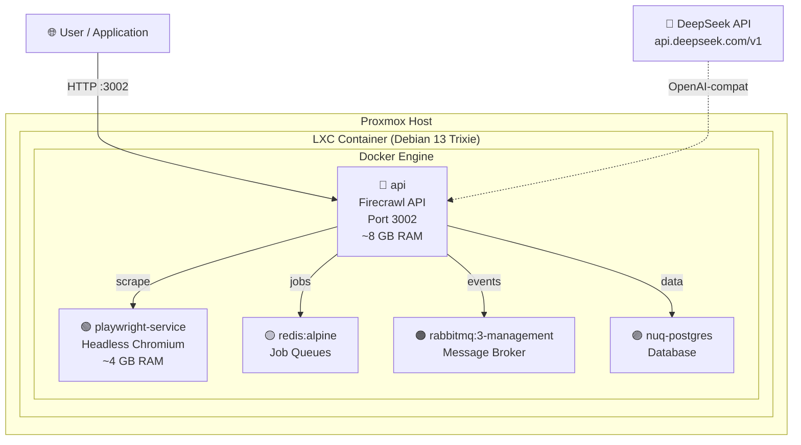

<p align="center">
  
</p>

<p align="center">
  <!-- Badges -->
  <a href="LICENSE"></a>
  
  
  
  
  <a href="https://github.com/rezurmas/firecrawl-proxmox/stargazers"></a>
  <a href="https://github.com/rezurmas/firecrawl-proxmox/network/members"></a>
  
</p>

<p align="center">
  <b>🇬🇧 English</b> &nbsp;|&nbsp;
  <a href="README.md">🇵🇱 Polski/English (bilingual)</a> &nbsp;|&nbsp;
  <a href="README.de.md">🇩🇪 Deutsch</a>
</p>

<br />

> **🔥 Zero compilation. One script. 5 minutes to a running instance.**

A complete toolkit for deploying a **self-hosted** [Firecrawl](https://github.com/firecrawl/firecrawl) instance on a **Proxmox LXC container** with **Debian 13 Trixie**, **Docker**, and **DeepSeek API** as the AI engine.

---

## 🚀 Quick Start

> **For experts —** TL;DR: commands without commentary. If something goes wrong, scroll down to the [full installation guide](#-full-installation-guide).

```bash
# ─── On the Proxmox host ─────────────────────────────────────────
# 1. Create an LXC container (details: lxc-setup.md)
#    🔑 CRITICAL: features: keyctl=1,nesting=1 (Docker won't work without this!)
pct set <CTID> -features keyctl=1,nesting=1

# ─── Inside the container ────────────────────────────────────────
# 2. Download the package
git clone https://github.com/rezurmas/firecrawl-proxmox.git
cd firecrawl-proxmox

# 3. Run the auto-installer (with DeepSeek key — full AI functionality)
chmod +x install.sh
DEEPSEEK_API_KEY="sk-your-api-key" ./install.sh

# 4. Check if it works
./check.sh
curl http://localhost:3002/v1/health
```

---

## 📖 Table of Contents

- [🚀 Quick Start](#-quick-start)
- [🎯 What is Firecrawl?](#-what-is-firecrawl)
- [🏗️ Architecture](#️-architecture)
- [📋 Requirements](#-requirements)
- [📦 What's Included?](#-whats-included)
- [🔧 Full Installation Guide](#-full-installation-guide)
- [🧠 LLM Configuration](#-llm-configuration)
- [🌐 API Reference](#-api-reference)
- [📊 Management Commands](#-management-commands)
- [🐛 Troubleshooting](#-troubleshooting)
- [🔐 Security Recommendations](#-security-recommendations)
- [🔄 How to Update](#-how-to-update)
- [🌍 GitHub Pages](#-github-pages)
- [📚 Resources & Links](#-resources--links)
- [📜 License](#-license)

---

## 🎯 What is Firecrawl?

**[Firecrawl](https://firecrawl.dev)** is a powerful open-source web scraping tool that turns any web page into clean, structured Markdown or JSON data — ideal for feeding AI models (LLMs), agents, and data pipelines.

**Why self-host on Proxmox?**

| Advantage | Description |
|---|---|
| 🔒 **Privacy** | Your data never leaves your infrastructure |
| 💰 **No API Limits** | No monthly subscriptions — unlimited scraping |
| ⚡ **Low Latency** | API on your local network — <5ms latency |
| 🧠 **Your Own LLM** | DeepSeek, OpenAI, Ollama — you choose |
| 🎛️ **Full Control** | Configuration, monitoring, backup — everything under your control |

---

## 🏗️ Architecture



**5 Docker containers** inside a single LXC:

<table>
<tr>
  <th>Service</th>
  <th>Image</th>
  <th>RAM</th>
  <th>Role</th>
</tr>
<tr>
  <td><code>api</code></td>
  <td><code>ghcr.io/firecrawl/firecrawl</code></td>
  <td>~8 GB</td>
  <td>Core logic, REST API, workers</td>
</tr>
<tr>
  <td><code>playwright-service</code></td>
  <td><code>ghcr.io/firecrawl/playwright-service</code></td>
  <td>~4 GB</td>
  <td>Headless Chromium for JS rendering</td>
</tr>
<tr>
  <td><code>redis</code></td>
  <td><code>redis:alpine</code></td>
  <td>~100 MB</td>
  <td>BullMQ job queues</td>
</tr>
<tr>
  <td><code>rabbitmq</code></td>
  <td><code>rabbitmq:3-management</code></td>
  <td>~500 MB</td>
  <td>Message broker between services</td>
</tr>
<tr>
  <td><code>nuq-postgres</code></td>
  <td><code>ghcr.io/firecrawl/nuq-postgres</code></td>
  <td>~200 MB</td>
  <td>Persistent data storage</td>
</tr>
</table>

> 💡 We use pre-built images from **GitHub Container Registry (ghcr.io)** — no local compilation needed!

---

## 📋 Requirements

<table>
<tr>
  <th>Component</th>
  <th align="center">Minimum</th>
  <th align="center">Recommended</th>
</tr>
<tr>
  <td>CPU</td>
  <td align="center">4 cores</td>
  <td align="center">8 cores</td>
</tr>
<tr>
  <td>RAM</td>
  <td align="center">8 GB</td>
  <td align="center">16 GB</td>
</tr>
<tr>
  <td>Storage</td>
  <td align="center">60 GB</td>
  <td align="center">100 GB+ SSD</td>
</tr>
<tr>
  <td>Swap</td>
  <td align="center">2 GB</td>
  <td align="center">4 GB</td>
</tr>
<tr>
  <td>Proxmox VE</td>
  <td align="center">7.x+</td>
  <td align="center">8.x+</td>
</tr>
<tr>
  <td>Template</td>
  <td colspan="2" align="center">Debian 13 Trixie</td>
</tr>
</table>

> ⚠️ **Why so much RAM?** Playwright (Chromium) needs ~2-4 GB just for the browser, the API with workers ~4-6 GB, and the remaining services ~2 GB. At 8 GB everything works, but with no headroom. If you plan intensive crawling — allocate 16 GB.

---

## 📦 What's Included?

```
firecrawl-proxmox/
├── 📖 README.md                          ← This file (you are here!)
├── 🚀 install.sh                         ← AUTO-INSTALLER — just run this!
├── 🔍 check.sh                           ← Health check script
├── 🖥️ lxc-setup.md                       ← LXC container setup guide
├── ⚙️ .env.example                       ← Configuration template
├── 🐳 docker-compose.override.yaml       ← Build → image override (no compilation!)
├── 🔧 firecrawl.service                  ← systemd service for auto-start
└── 🙈 .gitignore                         ← Git exclusions
```

---

## 🔧 Full Installation Guide

### Step 0: Preparing the LXC Container on Proxmox

Detailed instructions with GUI and CLI are in the **[lxc-setup.md](lxc-setup.md)** file.

<details>
<summary><b>📖 Expand — quick summary</b></summary>

<br />

**Via Proxmox GUI:**

| Tab | Setting | Value |
|---|---|---|
| **General** | CT ID | Any free ID, e.g. `152` |
| | Hostname | `firecrawl` |
| | Unprivileged | ✅ **CHECKED** |
| **Template** | Template | `debian-13-trixie-standard` |
| **Disks** | Root disk | Min. **60 GB** |
| **CPU** | Cores | Min. **4** |
| **Memory** | Memory | Min. **8192 MB** |
| | Swap | Min. **2048 MB** |
| **Network** | IPv4/CIDR | Per your network configuration |

**After creating the container — CRITICAL!:**

```bash
# On the Proxmox host — add nesting + keyctl
pct set <CTID> -features keyctl=1,nesting=1
pct start <CTID>
pct enter <CTID>
```

> 🔑 **Without `keyctl=1,nesting=1`, Docker WILL NOT start inside the LXC container!**

**Pre-installation verification:**

```bash
# Does nesting work? (should show a file list, NOT "Permission denied")
ls /proc/sys/net/ipv4/ | head -5

# Does keyctl work? (should show a key list, even if empty)
cat /proc/keys

# Is there internet access?
ping -c 1 google.com

# How much RAM?
free -h
```

</details>

---

### Step 1: Download and Run the Auto-Installer

```bash
# Clone the repository
git clone https://github.com/rezurmas/firecrawl-proxmox.git
cd firecrawl-proxmox
chmod +x install.sh

# Option A: With DeepSeek key (full AI functionality)
export DEEPSEEK_API_KEY="sk-your-api-key"
./install.sh

# Option B: Without API key (basic scrape/crawl only)
./install.sh
```

<details>
<summary><b>📖 What exactly does <code>install.sh</code> do?</b></summary>

<br />

The script performs **7 steps** automatically:

| Step | Description |
|---|---|
| **1/7** | Installs system dependencies (`curl`, `git`, `ca-certificates`, etc.) |
| **2/7** | Installs Docker + Docker Compose **using the correct method for Debian 13** (`.asc` + `.sources` DEB822) |
| **3/7** | Clones Firecrawl from GitHub to `/opt/firecrawl` |
| **4/7** | Creates `.env` with generated passwords and DeepSeek configuration |
| **5/7** | Overrides `docker-compose.yaml` — replaces `build:` with `image:` (pre-built GHCR images!) |
| **6/7** | Pulls Docker images and starts all 5 containers |
| **7/7** | Creates and enables a `systemd` service for auto-start on reboot |

</details>

---

### Step 2: Verification

```bash
# Run the check script — performs a full status audit
chmod +x check.sh && ./check.sh
```

The `check.sh` script checks:
- ✅ System (OS, RAM, disk, LXC nesting)
- ✅ Docker (version, daemon, compose)
- ✅ All 5 containers
- ✅ API — `/v1/health` + `/v1/scrape`
- ✅ `.env` configuration (keys, passwords)

Or manually:

```bash
# Check containers
docker compose -f /opt/firecrawl/docker-compose.yaml ps

# Test API
curl http://localhost:3002/v1/health
```

---

### Step 3: Access

- **API:** `http://<IP>:3002`
- **Bull Queue UI:** `http://<IP>:3002/admin/<BULL_AUTH_KEY>/queues`

> 💡 **How to find the container IP?** Run inside the container: `ip -4 addr show eth0 | grep -oP 'inet \K[\d.]+'`

---

## 🧠 LLM Configuration

Firecrawl uses an OpenAI-compatible API. **DeepSeek fully supports this format!**

### DeepSeek API (default)

| Setting | Value | Notes |
|---|---|---|
| `OPENAI_BASE_URL` | `https://api.deepseek.com/v1` | DeepSeek endpoint |
| `OPENAI_API_KEY` | `sk-your-key` | Key from [platform.deepseek.com](https://platform.deepseek.com) |
| `MODEL_NAME` | `deepseek-chat` | Standard model |
| `MODEL_EMBEDDING_NAME` | *empty* | ⚠️ DeepSeek has no embeddings! |

**What works with DeepSeek (supported):**
- ✅ `/v1/scrape` with `formats: ["json"]` — structured data extraction
- ✅ `/v1/scrape` with `onlyMainContent: true` — main content extraction
- ✅ `/v1/extract` — AI-powered data extraction from pages
- ✅ Basic scrape, crawl, map, search

**What's missing with DeepSeek (not supported):**
- ❌ Some advanced features requiring embeddings — consider OpenAI or Ollama

<details>
<summary><b>🔀 Alternative LLM engines</b></summary>

<br />

### OpenAI (full embedding support)

```ini
OPENAI_BASE_URL=https://api.openai.com/v1
OPENAI_API_KEY=sk-your-openai-key
MODEL_NAME=gpt-4o
MODEL_EMBEDDING_NAME=text-embedding-3-small
```

### Local Ollama (free, local)

```ini
OLLAMA_BASE_URL=http://host.docker.internal:11434/api
MODEL_NAME=llama3.1:8b
MODEL_EMBEDDING_NAME=nomic-embed-text
```

> 💡 Ollama must be installed on the LXC host. Download it from [ollama.com](https://ollama.com).

</details>

---

## 🌐 API Reference

Full documentation: [docs.firecrawl.dev](https://docs.firecrawl.dev)

> 🔁 Replace `<IP>` with your LXC container's IP address.

```bash
# ─── Health Check ─────────────────────────────────────────────────
curl http://<IP>:3002/v1/health
```

```bash
# ─── Scrape (get page content) ────────────────────────────────────
curl -X POST http://<IP>:3002/v1/scrape \
  -H 'Content-Type: application/json' \
  -d '{
    "url": "https://example.com",
    "formats": ["markdown", "html"]
  }'
```

```bash
# ─── Crawl (crawl all subpages) ───────────────────────────────────
curl -X POST http://<IP>:3002/v2/crawl \
  -H 'Content-Type: application/json' \
  -d '{
    "url": "https://docs.firecrawl.dev",
    "limit": 50
  }'
```

```bash
# ─── Map (discover all URLs on a page) ────────────────────────────
curl -X POST http://<IP>:3002/v2/map \
  -H 'Content-Type: application/json' \
  -d '{"url": "https://firecrawl.dev"}'
```

```bash
# ─── Extract (AI-powered extraction) ──────────────────────────────
curl -X POST http://<IP>:3002/v1/extract \
  -H 'Content-Type: application/json' \
  -d '{
    "urls": ["https://example.com"],
    "prompt": "Extract the main heading and all links"
  }'
```

```bash
# ─── Search (requires SearXNG) ────────────────────────────────────
curl -X POST http://<IP>:3002/v1/search \
  -H 'Content-Type: application/json' \
  -d '{"query": "firecrawl web scraping", "limit": 5}'
```

---

## 📊 Management Commands

### Docker Compose

```bash
# Status of all containers
docker compose -f /opt/firecrawl/docker-compose.yaml ps

# Live logs
docker compose -f /opt/firecrawl/docker-compose.yaml logs -f api

# Restart a single service
docker compose -f /opt/firecrawl/docker-compose.yaml restart playwright-service

# Stop everything
cd /opt/firecrawl && docker compose down

# Start everything
cd /opt/firecrawl && docker compose up -d
```

### Systemd

```bash
# Check service status
systemctl status firecrawl

# Service logs
journalctl -u firecrawl -f

# Restart everything
systemctl restart firecrawl

# Stop
systemctl stop firecrawl

# Disable auto-start
systemctl disable firecrawl

# Enable auto-start
systemctl enable firecrawl
```

### Database Backup

```bash
# Export PostgreSQL database
docker compose -f /opt/firecrawl/docker-compose.yaml \
  exec nuq-postgres pg_dump -U firecrawl firecrawl \
  > "firecrawl_backup_$(date +%Y%m%d_%H%M%S).sql"
```

---

## 🐛 Troubleshooting

<details>
<summary><b>🔍 Expand full troubleshooting table</b></summary>

<br />

<table>
<tr>
  <th>Problem</th>
  <th>Cause</th>
  <th>Solution</th>
</tr>
<tr>
  <td><code>apt update</code>: <code>sqv</code> error</td>
  <td>Debian 13 requires <code>.asc</code> + <code>.sources</code></td>
  <td>Use <code>install.sh</code> — it uses the correct method</td>
</tr>
<tr>
  <td>Docker: <code>Operation not permitted</code></td>
  <td>Missing <code>keyctl=1,nesting=1</code> in LXC</td>
  <td><code>pct set &lt;CTID&gt; -features keyctl=1,nesting=1</code></td>
</tr>
<tr>
  <td>API: connection refused</td>
  <td>API not listening</td>
  <td><code>docker compose ps</code>, check logs: <code>docker compose logs api</code></td>
</tr>
<tr>
  <td>Playwright timeout</td>
  <td>Not enough RAM</td>
  <td>Increase RAM to 12+ GB</td>
</tr>
<tr>
  <td>OOM killer kills containers</td>
  <td>Running out of RAM</td>
  <td>Increase RAM, reduce <code>MAX_RAM=0.6</code></td>
</tr>
<tr>
  <td>RabbitMQ won't start</td>
  <td>Healthcheck needs more time</td>
  <td><code>docker compose logs rabbitmq</code>, wait longer</td>
</tr>
<tr>
  <td>"Supabase client is not configured"</td>
  <td><b>Normal in self-hosted!</b></td>
  <td>Ignore — self-hosted has no Supabase</td>
</tr>
<tr>
  <td>ghcr.io rate limit</td>
  <td>GitHub limit for anonymous pulls</td>
  <td><code>echo "TOKEN" | docker login ghcr.io -u USER --password-stdin</code></td>
</tr>
<tr>
  <td>No <code>debian-13</code> in templates</td>
  <td>Outdated list</td>
  <td><code>pveam update</code> on Proxmox host</td>
</tr>
<tr>
  <td><code>/proc/keys</code>: Permission denied</td>
  <td>Missing <code>keyctl=1</code></td>
  <td>Add <code>keyctl=1</code> to LXC features</td>
</tr>
<tr>
  <td>API works locally, not remotely</td>
  <td>Firewall / routing</td>
  <td>Check <code>iptables</code>, Proxmox firewall rules</td>
</tr>
<tr>
  <td>Disk full</td>
  <td>Docker logs / data</td>
  <td><code>docker system prune -a</code> (carefully!)</td>
</tr>
</table>

</details>

### ⚡ Quick Fixes for Common Problems

**Docker won't install — `sqv` / `docker.gpg` error:**

> Debian 13 Trixie uses the new `sqv` verifier instead of `gpg`. Our `install.sh` uses the correct method (`.asc` + `.sources` DEB822). Don't use old tutorials with `.gpg`!

**Docker won't start — `Operation not permitted`:**

```bash
# On the Proxmox host:
pct set <CTID> -features keyctl=1,nesting=1
pct stop <CTID> && pct start <CTID>
```

**Playwright timeout / OOM killer:**

```bash
# Reduce limits in .env:
MAX_CONCURRENT_JOBS=2   # default 5
BROWSER_POOL_SIZE=2     # default 5
MAX_RAM=0.6             # default 0.8
```

---

## 🔐 Security Recommendations

> ⚠️ **Self-hosted = you are responsible for security!**

1. **Change all default passwords** — `POSTGRES_PASSWORD`, `BULL_AUTH_KEY` (minimum 32 characters)
2. **Do NOT expose port 3002 directly to the internet!** — use a reverse proxy (nginx/Caddy/Traefik) with HTTPS and a Let's Encrypt certificate
3. **Secure the `.env.credentials` file** — it's automatically `chmod 600`, but verify:
   ```bash
   chmod 600 /opt/firecrawl/.env.credentials
   ```
4. **Restrict access with Proxmox firewall** — only trusted IPs can connect to port 3002
5. **Update regularly** — `git pull && docker compose pull && docker compose up -d`
6. **Monitor logs** — `journalctl -u firecrawl -f`

<details>
<summary><b>🔒 Example: Reverse proxy with Caddy (click to expand)</b></summary>

<br />

```caddyfile
firecrawl.your-domain.com {
    reverse_proxy localhost:3002
}
```

```bash
# Install Caddy on Debian
apt install -y debian-keyring debian-archive-keyring apt-transport-https
curl -1sLf 'https://dl.cloudsmith.io/public/caddy/stable/gpg.key' | \
  gpg --dearmor -o /usr/share/keyrings/caddy-stable-archive-keyring.gpg
curl -1sLf 'https://dl.cloudsmith.io/public/caddy/stable/debian.deb.txt' | \
  tee /etc/apt/sources.list.d/caddy-stable.list
apt update && apt install caddy

# Automatic HTTPS with Let's Encrypt — nothing else needed!
```

</details>

---

## 🔄 How to Update

```bash
# 1. Stop Firecrawl
systemctl stop firecrawl
# or: cd /opt/firecrawl && docker compose down

# 2. Pull latest changes
cd /opt/firecrawl
git pull origin main

# 3. Pull new Docker images
docker compose pull

# 4. Start again
docker compose up -d
systemctl start firecrawl

# 5. Verify
curl http://localhost:3002/v1/health
```

> 💡 **Pro tip:** Add this as a cron job (e.g., once a week at night) for automatic updates.
> ```bash
> # crontab -e
> 0 3 * * 0 cd /opt/firecrawl && git pull origin main && docker compose pull && docker compose up -d
> ```

---

## 🌍 GitHub Pages

To make your repo look professional on GitHub, configure:

<table>
<tr>
  <th>Element</th>
  <th>Recommendation</th>
</tr>
<tr>
  <td><b>About (description)</b></td>
  <td><code>🚀 Self-host Firecrawl on Proxmox LXC in 5 minutes — zero compilation, one script. Full DeepSeek AI integration.</code></td>
</tr>
<tr>
  <td><b>Website</b></td>
  <td>Link to <code>docs.firecrawl.dev</code> or your own documentation</td>
</tr>
<tr>
  <td><b>Topics / Tags</b></td>
  <td><code>firecrawl</code> <code>proxmox</code> <code>lxc</code> <code>debian</code> <code>docker</code> <code>self-hosted</code> <code>web-scraping</code> <code>deepseek</code> <code>ai</code> <code>llm</code></td>
</tr>
<tr>
  <td><b>Releases</b></td>
  <td>Create a Release with version <code>v1.0.0</code>, link to install.sh</td>
</tr>
<tr>
  <td><b>Social preview</b></td>
  <td>Add a <code>preview.png</code> image (1280×640 px) to the repo root — it will appear in links on Discord, Twitter, etc.</td>
</tr>
</table>

---

## 📚 Resources & Links

### Official Sources

| Link | Description |
|---|---|
| [Firecrawl GitHub](https://github.com/firecrawl/firecrawl) | Firecrawl source code |
| [Firecrawl Docs](https://docs.firecrawl.dev) | Official API documentation |
| [DeepSeek Platform](https://platform.deepseek.com) | DeepSeek API keys |
| [Proxmox VE](https://www.proxmox.com) | Proxmox website |
| [Docker Engine — Debian](https://docs.docker.com/engine/install/debian/) | Docker installation on Debian |

### Community

| Link | Description |
|---|---|
| [Firecrawl Discord](https://discord.gg/firecrawl) | Official Firecrawl Discord — questions, support, community |
| [Proxmox Forum](https://forum.proxmox.com) | Proxmox Forum — LXC, networking, storage |
| [Docker Community](https://forums.docker.com) | Docker Forum |

---

## 📜 License

- **Firecrawl:** [AGPL-3.0](https://github.com/firecrawl/firecrawl/blob/main/LICENSE)
- **This guide & scripts:** [MIT](LICENSE)
