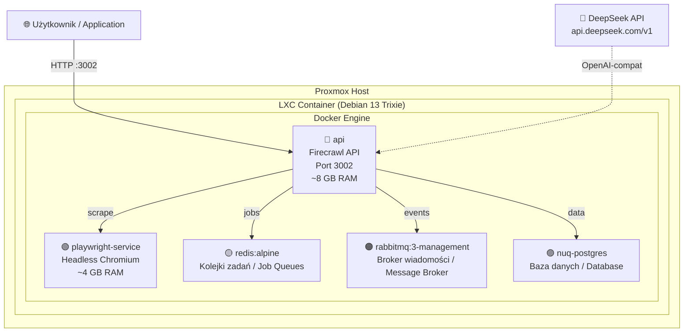

<p align="center">
  
</p>

<p align="center">
  <!-- Badges -->
  <a href="LICENSE"></a>
  
  
  
  
  <a href="https://github.com/rezurmas/firecrawl-proxmox/stargazers"></a>
  <a href="https://github.com/rezurmas/firecrawl-proxmox/network/members"></a>
  
</p>

<p align="center">
  <b>🇵🇱 Polski</b> &nbsp;|&nbsp;
  <a href="README.en.md">🇬🇧 English</a> &nbsp;|&nbsp;
  <a href="README.de.md">🇩🇪 Deutsch</a>
</p>

<p align="center">
  <i>Dokumentacja dwujęzyczna — najpierw polski, angielskie odpowiedniki w nawiasach</i><br/>
  <i>Bilingual documentation — Polish first, English equivalents in parentheses</i>
</p>

<br />

> **🔥 Zero kompilacji. Jeden skrypt. 5 minut do działającej instancji.**  
> *Zero compilation. One script. 5 minutes to a running instance.*

Kompletny zestaw do postawienia własnej, **self-hosted** instancji [Firecrawl](https://github.com/firecrawl/firecrawl) na kontenerze **Proxmox LXC** z **Debianem 13 Trixie**, **Dockerem** i **DeepSeek API** jako silnikiem AI.

A complete toolkit for deploying a self-hosted [Firecrawl](https://github.com/firecrawl/firecrawl) instance on a **Proxmox LXC container** running **Debian 13 Trixie**, with **Docker** and **DeepSeek API** as the AI engine.

---

## 🚀 Szybki Start (Quick Start)

> **Dla ekspertów —** TL;DR: komendy bez komentarza. Jeśli coś pójdzie nie tak, przewiń do [pełnej instrukcji](#-pełna-instalacja-full-installation-guide).

```bash
# ─── Na hoście Proxmox ───────────────────────────────────────────
# 1. Stwórz kontener LXC (szczegóły: lxc-setup.md)
#    🔑 KLUCZOWE: features: keyctl=1,nesting=1 (bez tego Docker nie działa!)
pct set <CTID> -features keyctl=1,nesting=1

# ─── W kontenerze ────────────────────────────────────────────────
# 2. Pobierz paczkę
git clone https://github.com/rezurmas/firecrawl-proxmox.git
cd firecrawl-proxmox

# 3. Odpal autoinstalator (z kluczem DeepSeek — pełna funkcjonalność AI)
chmod +x install.sh
DEEPSEEK_API_KEY="sk-twój-klucz-api" ./install.sh

# 4. Sprawdź czy działa
./check.sh
curl http://localhost:3002/v1/health
```

---

## 📖 Spis Treści (Table of Contents)

- [🚀 Szybki Start](#-szybki-start-quick-start)
- [🎯 Czym jest Firecrawl?](#-czym-jest-firecrawl-what-is-this)
- [🏗️ Architektura](#️-architektura-architecture)
- [📋 Wymagania](#-wymagania-requirements)
- [📦 Co jest w paczce?](#-co-jest-w-paczce-whats-included)
- [🔧 Pełna instalacja](#-pełna-instalacja-full-installation-guide)
- [🧠 Konfiguracja LLM](#-konfiguracja-llm-llm-configuration)
- [🌐 API Reference](#-api-reference)
- [📊 Zarządzanie](#-zarządzanie-management-commands)
- [🐛 Troubleshooting](#-troubleshooting)
- [🔐 Bezpieczeństwo](#-bezpieczeństwo-security-recommendations)
- [🔄 Jak aktualizować](#-jak-aktualizować-how-to-update)
- [🌍 GitHub Pages](#-github-pages)
- [📚 Zasoby & Linki](#-zasoby--linki-resources--links)
- [📜 Licencja](#-licencja-license)

---

## 🎯 Czym jest Firecrawl? (What is this?)

**[Firecrawl](https://firecrawl.dev)** to potężne narzędzie open-source do web scrapingu, które zamienia każdą stronę internetową w czysty, strukturyzowany Markdown lub dane JSON — idealne do zasilania modeli AI (LLM), agentów i pipeline'ów danych.

**Dlaczego self-host na Proxmox?**

| Zalety | Opis |
|---|---|
| 🔒 **Prywatność** | Twoje dane nie opuszczają Twojej infrastruktury |
| 💰 **Brak limitów API** | Bez miesięcznych subskrypcji — nieograniczone scrape'owanie |
| ⚡ **Niskie opóźnienia** | API w Twojej sieci lokalnej — <5ms latency |
| 🧠 **Własny LLM** | DeepSeek, OpenAI, Ollama — Ty wybierasz |
| 🎛️ **Pełna kontrola** | Konfiguracja, monitoring, backup — wszystko u Ciebie |

---

## 🏗️ Architektura (Architecture)



**5 kontenerów Docker** wewnątrz jednego LXC:

<table>
<tr>
  <th>Serwis</th>
  <th>Obraz</th>
  <th>RAM</th>
  <th>Rola</th>
</tr>
<tr>
  <td><code>api</code></td>
  <td><code>ghcr.io/firecrawl/firecrawl</code></td>
  <td>~8 GB</td>
  <td>Główna logika, REST API, workery</td>
</tr>
<tr>
  <td><code>playwright-service</code></td>
  <td><code>ghcr.io/firecrawl/playwright-service</code></td>
  <td>~4 GB</td>
  <td>Headless Chromium do JS-renderingu</td>
</tr>
<tr>
  <td><code>redis</code></td>
  <td><code>redis:alpine</code></td>
  <td>~100 MB</td>
  <td>Kolejki zadań BullMQ</td>
</tr>
<tr>
  <td><code>rabbitmq</code></td>
  <td><code>rabbitmq:3-management</code></td>
  <td>~500 MB</td>
  <td>Broker wiadomości między serwisami</td>
</tr>
<tr>
  <td><code>nuq-postgres</code></td>
  <td><code>ghcr.io/firecrawl/nuq-postgres</code></td>
  <td>~200 MB</td>
  <td>Trwałe przechowywanie danych</td>
</tr>
</table>

> 💡 Używamy gotowych obrazów z **GitHub Container Registry (ghcr.io)** — nie trzeba nic kompilować lokalnie!  
> *We use pre-built images from GHCR — no local compilation needed!*

---

## 📋 Wymagania (Requirements)

<table>
<tr>
  <th>Komponent</th>
  <th align="center">Minimum</th>
  <th align="center">Rekomendowane</th>
</tr>
<tr>
  <td>CPU</td>
  <td align="center">4 rdzenie</td>
  <td align="center">8 rdzeni</td>
</tr>
<tr>
  <td>RAM</td>
  <td align="center">8 GB</td>
  <td align="center">16 GB</td>
</tr>
<tr>
  <td>Dysk (Storage)</td>
  <td align="center">60 GB</td>
  <td align="center">100 GB+ SSD</td>
</tr>
<tr>
  <td>Swap</td>
  <td align="center">2 GB</td>
  <td align="center">4 GB</td>
</tr>
<tr>
  <td>Proxmox VE</td>
  <td align="center">7.x+</td>
  <td align="center">8.x+</td>
</tr>
<tr>
  <td>Szablon (Template)</td>
  <td colspan="2" align="center">Debian 13 Trixie</td>
</tr>
</table>

> ⚠️ **Dlaczego tyle RAM?** Playwright (Chromium) potrzebuje ~2-4 GB na samą przeglądarkę, API z workerami ~4-6 GB, reszta usług ~2 GB. Przy 8 GB wszystko działa, ale bez zapasu. Jeśli planujesz intensywne crawl'owanie — daj 16 GB.

---

## 📦 Co jest w paczce? (What's Included?)

```
firecrawl-proxmox/
├── 📖 README.md                          ← Ten plik (jesteś tutaj!)
├── 🚀 install.sh                         ← AUTOINSTALATOR — uruchom tylko to!
│                                            Auto-installer — just run this!
├── 🔍 check.sh                           ← Skrypt sprawdzający stan (health check)
├── 🖥️ lxc-setup.md                       ← Instrukcja tworzenia kontenera LXC
│                                            LXC container setup guide
├── ⚙️ .env.example                       ← Szablon konfiguracji (configuration template)
├── 🐳 docker-compose.override.yaml       ← Podmiana build → image (bez kompilacji)
│                                            Pre-built images override (no build!)
├── 🔧 firecrawl.service                  ← Usługa systemd do autostartu
│                                            systemd service for auto-start
└── 🙈 .gitignore                         ← Wykluczenia Git
```

---

## 🔧 Pełna Instalacja (Full Installation Guide)

### Krok 0: Przygotowanie kontenera LXC na Proxmox

Szczegółowa instrukcja z GUI i CLI w pliku **[lxc-setup.md](lxc-setup.md)**.

<details>
<summary><b>📖 Rozwiń — szybkie podsumowanie (quick summary)</b></summary>

<br />

**Przez GUI Proxmox:**

| Zakładka | Ustawienie | Wartość |
|---|---|---|
| **General** | CT ID | Dowolne wolne, np. `152` |
| | Hostname | `firecrawl` |
| | Unprivileged | ✅ **ZAZNACZONE** |
| **Template** | Template | `debian-13-trixie-standard` |
| **Disks** | Root disk | Min. **60 GB** |
| **CPU** | Cores | Min. **4** |
| **Memory** | Memory | Min. **8192 MB** |
| | Swap | Min. **2048 MB** |
| **Network** | IPv4/CIDR | Wg Twojej sieci / per your network |

**Po stworzeniu kontenera — KLUCZOWE! (AFTER CREATION — CRITICAL!):**

```bash
# Na hoście Proxmox — dodaj nesting + keyctl
pct set <CTID> -features keyctl=1,nesting=1
pct start <CTID>
pct enter <CTID>
```

> 🔑 **Bez `keyctl=1,nesting=1` Docker NIE wystartuje w kontenerze LXC!**

**Weryfikacja przed instalacją:**

```bash
# Czy nesting działa? (powinno pokazać listę plików, NIE "Permission denied")
ls /proc/sys/net/ipv4/ | head -5

# Czy keyctl działa? (powinno pokazać listę kluczy, nawet pustą)
cat /proc/keys

# Czy jest internet?
ping -c 1 google.com

# Ile RAM?
free -h
```

</details>

---

### Krok 1: Pobranie i uruchomienie autoinstalatora

```bash
# Pobierz repozytorium
git clone https://github.com/rezurmas/firecrawl-proxmox.git
cd firecrawl-proxmox
chmod +x install.sh

# Opcja A: Z kluczem DeepSeek (pełna funkcjonalność AI)
export DEEPSEEK_API_KEY="sk-twój-klucz-api"
./install.sh

# Opcja B: Bez klucza API (tylko podstawowe scrape/crawl)
./install.sh
```

<details>
<summary><b>📖 Co dokładnie robi <code>install.sh</code>?</b></summary>

<br />

Skrypt wykonuje **7 kroków** automatycznie:

| Krok | Opis |
|---|---|
| **1/7** | Instaluje zależności systemowe (`curl`, `git`, `ca-certificates`, itp.) |
| **2/7** | Instaluje Docker + Docker Compose **poprawną metodą dla Debiana 13** (`.asc` + `.sources` DEB822) |
| **3/7** | Klonuje Firecrawl z GitHub do `/opt/firecrawl` |
| **4/7** | Tworzy `.env` z wygenerowanymi hasłami i konfiguracją DeepSeek |
| **5/7** | Podmienia `docker-compose.yaml` — zamienia `build:` na `image:` (gotowe obrazy GHCR!) |
| **6/7** | Pobiera obrazy Docker i uruchamia wszystkie 5 kontenerów |
| **7/7** | Tworzy i włącza usługę `systemd` do autostartu po restarcie |

</details>

---

### Krok 2: Weryfikacja (Verification)

```bash
# Uruchom skrypt sprawdzający — zrobi pełny audyt stanu
chmod +x check.sh && ./check.sh
```

Skrypt `check.sh` sprawdza:
- ✅ System (OS, RAM, dysk, LXC nesting)
- ✅ Docker (wersja, daemon, compose)
- ✅ Wszystkie 5 kontenerów
- ✅ API — `/v1/health` + `/v1/scrape`
- ✅ Konfigurację `.env` (klucze, hasła)

Lub ręcznie (manually):

```bash
# Sprawdź kontenery
docker compose -f /opt/firecrawl/docker-compose.yaml ps

# Test API
curl http://localhost:3002/v1/health
```

---

### Krok 3: Dostęp (Access)

- **API:** `http://<IP>:3002`
- **Bull Queue UI (kolejki):** `http://<IP>:3002/admin/<BULL_AUTH_KEY>/queues`

> 💡 **Jak znaleźć IP kontenera?** Wykonaj w kontenerze: `ip -4 addr show eth0 | grep -oP 'inet \K[\d.]+'`

---

## 🧠 Konfiguracja LLM (LLM Configuration)

Firecrawl używa API kompatybilnego z OpenAI. **DeepSeek w pełni wspiera ten format!**

### DeepSeek API (domyślna / default)

| Ustawienie | Wartość | Uwagi |
|---|---|---|
| `OPENAI_BASE_URL` | `https://api.deepseek.com/v1` | Endpoint DeepSeek |
| `OPENAI_API_KEY` | `sk-twój-klucz` | Klucz z [platform.deepseek.com](https://platform.deepseek.com) |
| `MODEL_NAME` | `deepseek-chat` | Standardowy model |
| `MODEL_EMBEDDING_NAME` | *puste / empty* | ⚠️ DeepSeek nie ma embeddingów! |

**Co działa z DeepSeek (supported):**
- ✅ `/v1/scrape` z `formats: ["json"]` — ekstrakcja strukturyzowanych danych
- ✅ `/v1/scrape` z `onlyMainContent: true` — ekstrakcja głównej treści
- ✅ `/v1/extract` — ekstrakcja danych ze stron z użyciem AI
- ✅ Podstawowe scrape, crawl, map, search

**Czego brakuje z DeepSeek (not supported):**
- ❌ Niektóre zaawansowane funkcje wymagające embeddingów — rozważ OpenAI lub Ollama

<details>
<summary><b>🔀 Alternatywne silniki LLM (alternative LLM engines)</b></summary>

<br />

### OpenAI (pełne wsparcie embeddingów)

```ini
OPENAI_BASE_URL=https://api.openai.com/v1
OPENAI_API_KEY=sk-twój-klucz-openai
MODEL_NAME=gpt-4o
MODEL_EMBEDDING_NAME=text-embedding-3-small
```

### Lokalne Ollama (bezpłatnie / free, lokalnie / local)

```ini
OLLAMA_BASE_URL=http://host.docker.internal:11434/api
MODEL_NAME=llama3.1:8b
MODEL_EMBEDDING_NAME=nomic-embed-text
```

> 💡 Ollama musi być zainstalowana na hoście LXC. Ściągnij z [ollama.com](https://ollama.com).

</details>

---

## 🌐 API Reference

Pełna dokumentacja: [docs.firecrawl.dev](https://docs.firecrawl.dev)

> 🔁 Zastąp `<IP>` adresem IP swojego kontenera LXC.  
> *Replace `<IP>` with your LXC container's IP address.*

```bash
# ─── Health Check ─────────────────────────────────────────────────
curl http://<IP>:3002/v1/health
```

```bash
# ─── Scrape (pobierz zawartość strony / get page content) ─────────
curl -X POST http://<IP>:3002/v1/scrape \
  -H 'Content-Type: application/json' \
  -d '{
    "url": "https://example.com",
    "formats": ["markdown", "html"]
  }'
```

```bash
# ─── Crawl (przejdź wszystkie podstrony / crawl all subpages) ─────
curl -X POST http://<IP>:3002/v2/crawl \
  -H 'Content-Type: application/json' \
  -d '{
    "url": "https://docs.firecrawl.dev",
    "limit": 50
  }'
```

```bash
# ─── Map (znajdź wszystkie URLe na stronie / discover all URLs) ───
curl -X POST http://<IP>:3002/v2/map \
  -H 'Content-Type: application/json' \
  -d '{"url": "https://firecrawl.dev"}'
```

```bash
# ─── Extract (wyciągnij dane z AI / AI-powered extraction) ────────
curl -X POST http://<IP>:3002/v1/extract \
  -H 'Content-Type: application/json' \
  -d '{
    "urls": ["https://example.com"],
    "prompt": "Extract the main heading and all links"
  }'
```

```bash
# ─── Search (wymaga SearXNG / requires SearXNG) ───────────────────
curl -X POST http://<IP>:3002/v1/search \
  -H 'Content-Type: application/json' \
  -d '{"query": "firecrawl web scraping", "limit": 5}'
```

---

## 📊 Zarządzanie (Management Commands)

### Docker Compose

```bash
# Status wszystkich kontenerów
docker compose -f /opt/firecrawl/docker-compose.yaml ps

# Logi na żywo (live logs)
docker compose -f /opt/firecrawl/docker-compose.yaml logs -f api

# Restart pojedynczego serwisu
docker compose -f /opt/firecrawl/docker-compose.yaml restart playwright-service

# Zatrzymaj wszystko (stop all)
cd /opt/firecrawl && docker compose down

# Uruchom ponownie (start all)
cd /opt/firecrawl && docker compose up -d
```

### Systemd

```bash
# Sprawdź status usługi
systemctl status firecrawl

# Logi usługi
journalctl -u firecrawl -f

# Restart wszystkiego
systemctl restart firecrawl

# Zatrzymaj
systemctl stop firecrawl

# Wyłącz autostart (disable auto-start)
systemctl disable firecrawl

# Włącz autostart (enable auto-start)
systemctl enable firecrawl
```

### Backup bazy danych (Database Backup)

```bash
# Eksport bazy PostgreSQL
docker compose -f /opt/firecrawl/docker-compose.yaml \
  exec nuq-postgres pg_dump -U firecrawl firecrawl \
  > "firecrawl_backup_$(date +%Y%m%d_%H%M%S).sql"
```

---

## 🐛 Troubleshooting

<details>
<summary><b>🔍 Rozwiń pełną tabelę problemów (expand full troubleshooting table)</b></summary>

<br />

<table>
<tr>
  <th>Problem</th>
  <th>Przyczyna (Cause)</th>
  <th>Rozwiązanie (Solution)</th>
</tr>
<tr>
  <td><code>apt update</code>: błąd <code>sqv</code></td>
  <td>Debian 13 wymaga <code>.asc</code> + <code>.sources</code></td>
  <td>Użyj <code>install.sh</code> — używa poprawnej metody</td>
</tr>
<tr>
  <td>Docker: <code>Operation not permitted</code></td>
  <td>Brak <code>keyctl=1,nesting=1</code> w LXC</td>
  <td><code>pct set &lt;CTID&gt; -features keyctl=1,nesting=1</code></td>
</tr>
<tr>
  <td>API: connection refused</td>
  <td>API nie nasłuchuje</td>
  <td><code>docker compose ps</code>, sprawdź logi: <code>docker compose logs api</code></td>
</tr>
<tr>
  <td>Playwright timeout</td>
  <td>Za mało RAM</td>
  <td>Zwiększ RAM do 12+ GB</td>
</tr>
<tr>
  <td>OOM killer zabija kontenery</td>
  <td>RAM się kończy</td>
  <td>Zwiększ RAM, zmniejsz <code>MAX_RAM=0.6</code></td>
</tr>
<tr>
  <td>RabbitMQ nie wstaje</td>
  <td>Healthcheck potrzebuje więcej czasu</td>
  <td><code>docker compose logs rabbitmq</code>, poczekaj dłużej</td>
</tr>
<tr>
  <td>"Supabase client is not configured"</td>
  <td><b>Normalne w self-hosted!</b></td>
  <td>Ignoruj — self-hosted nie ma Supabase</td>
</tr>
<tr>
  <td>ghcr.io rate limit</td>
  <td>GitHub limit dla anonimowych pull</td>
  <td><code>echo "TOKEN" | docker login ghcr.io -u USER --password-stdin</code></td>
</tr>
<tr>
  <td>Brak <code>debian-13</code> w szablonach</td>
  <td>Nieaktualna lista</td>
  <td><code>pveam update</code> na hoście Proxmox</td>
</tr>
<tr>
  <td><code>/proc/keys</code>: Permission denied</td>
  <td>Brak <code>keyctl=1</code></td>
  <td>Dodaj <code>keyctl=1</code> do features LXC</td>
</tr>
<tr>
  <td>API działa lokalnie, nie zdalnie</td>
  <td>Firewall / routing</td>
  <td>Sprawdź <code>iptables</code>, reguły firewall Proxmox</td>
</tr>
<tr>
  <td>Brak miejsca na dysku</td>
  <td>Logi Docker / dane</td>
  <td><code>docker system prune -a</code> (ostrożnie!)</td>
</tr>
</table>

</details>

### ⚡ Szybkie fixy na częste problemy

**Docker nie instaluje się — błąd `sqv` / `docker.gpg`:**

> Debian 13 Trixie używa nowego weryfikatora `sqv` zamiast `gpg`. Nasz `install.sh` używa poprawnej metody (`.asc` + `.sources` DEB822). Nie używaj starych poradników z `.gpg`!

**Docker nie startuje — `Operation not permitted`:**

```bash
# Na hoście Proxmox:
pct set <CTID> -features keyctl=1,nesting=1
pct stop <CTID> && pct start <CTID>
```

**Playwright timeout / OOM killer:**

```bash
# Zmniejsz limity w .env:
MAX_CONCURRENT_JOBS=2   # domyślnie 5
BROWSER_POOL_SIZE=2     # domyślnie 5
MAX_RAM=0.6             # domyślnie 0.8
```

---

## 🔐 Bezpieczeństwo (Security Recommendations)

> ⚠️ **Self-hosted = Ty odpowiadasz za bezpieczeństwo!**

1. **Zmień wszystkie domyślne hasła** — `POSTGRES_PASSWORD`, `BULL_AUTH_KEY` (minimum 32 znaki)
2. **Nie wystawiaj portu 3002 bezpośrednio na internet!** — użyj reverse proxy (nginx/Caddy/Traefik) z HTTPS i certyfikatem Let's Encrypt
3. **Zabezpiecz plik `.env.credentials`** — jest automatycznie `chmod 600`, ale upewnij się:
   ```bash
   chmod 600 /opt/firecrawl/.env.credentials
   ```
4. **Ogranicz dostęp firewallem Proxmox** — tylko zaufane IP mogą łączyć się na port 3002
5. **Regularnie aktualizuj** — `git pull && docker compose pull && docker compose up -d`
6. **Monitoruj logi** — `journalctl -u firecrawl -f`

<details>
<summary><b>🔒 Przykład: Reverse proxy z Caddy (click to expand)</b></summary>

<br />

```caddyfile
firecrawl.twoja-domena.pl {
    reverse_proxy localhost:3002
}
```

```bash
# Instalacja Caddy na Debianie
apt install -y debian-keyring debian-archive-keyring apt-transport-https
curl -1sLf 'https://dl.cloudsmith.io/public/caddy/stable/gpg.key' | \
  gpg --dearmor -o /usr/share/keyrings/caddy-stable-archive-keyring.gpg
curl -1sLf 'https://dl.cloudsmith.io/public/caddy/stable/debian.deb.txt' | \
  tee /etc/apt/sources.list.d/caddy-stable.list
apt update && apt install caddy

# Automatyczny HTTPS z Let's Encrypt — nic więcej nie trzeba!
```

</details>

---

## 🔄 Jak aktualizować (How to Update)

```bash
# 1. Zatrzymaj Firecrawl
systemctl stop firecrawl
# lub: cd /opt/firecrawl && docker compose down

# 2. Pobierz najnowsze zmiany
cd /opt/firecrawl
git pull origin main

# 3. Pobierz nowe obrazy Docker
docker compose pull

# 4. Uruchom ponownie
docker compose up -d
systemctl start firecrawl

# 5. Zweryfikuj
curl http://localhost:3002/v1/health
```

> 💡 **Pro tip:** Dodaj to jako cron job (np. raz w tygodniu w nocy) dla automatycznych aktualizacji.
> ```bash
> # crontab -e
> 0 3 * * 0 cd /opt/firecrawl && git pull origin main && docker compose pull && docker compose up -d
> ```

---

## 🌍 GitHub Pages

Aby Twoje repo wyglądało profesjonalnie na GitHub, skonfiguruj:

<table>
<tr>
  <th>Element</th>
  <th>Rekomendacja</th>
</tr>
<tr>
  <td><b>About (opis)</b></td>
  <td><code>🚀 Self-host Firecrawl on Proxmox LXC in 5 minutes — zero compilation, one script. Full DeepSeek AI integration.</code></td>
</tr>
<tr>
  <td><b>Website</b></td>
  <td>Link do <code>docs.firecrawl.dev</code> lub swojej dokumentacji</td>
</tr>
<tr>
  <td><b>Topics / Tagi</b></td>
  <td><code>firecrawl</code> <code>proxmox</code> <code>lxc</code> <code>debian</code> <code>docker</code> <code>self-hosted</code> <code>web-scraping</code> <code>deepseek</code> <code>ai</code> <code>llm</code></td>
</tr>
<tr>
  <td><b>Releases</b></td>
  <td>Utwórz Release z wersją <code>v1.0.0</code>, podlinkuj do install.sh</td>
</tr>
<tr>
  <td><b>Social preview</b></td>
  <td>Dodaj obrazek <code>preview.png</code> (1280×640 px) do roota repo — pojawi się w linkach na Discord, Twitter, itp.</td>
</tr>
</table>

---

## 📚 Zasoby & Linki (Resources & Links)

### Oficjalne źródła

| Link | Opis |
|---|---|
| [Firecrawl GitHub](https://github.com/firecrawl/firecrawl) | Kod źródłowy Firecrawl |
| [Firecrawl Docs](https://docs.firecrawl.dev) | Oficjalna dokumentacja API |
| [DeepSeek Platform](https://platform.deepseek.com) | Klucze API DeepSeek |
| [Proxmox VE](https://www.proxmox.com) | Strona Proxmox |
| [Docker Engine — Debian](https://docs.docker.com/engine/install/debian/) | Instalacja Dockera na Debianie |

### Społeczność

| Link | Opis |
|---|---|
| [Firecrawl Discord](https://discord.gg/firecrawl) | Oficjalny Discord Firecrawl — pytania, support, community |
| [Proxmox Forum](https://forum.proxmox.com) | Forum Proxmox — LXC, networking, storage |
| [Docker Community](https://forums.docker.com) | Forum Dockera |

---

## 📜 Licencja (License)

- **Firecrawl:** [AGPL-3.0](https://github.com/firecrawl/firecrawl/blob/main/LICENSE)
- **Ten poradnik i skrypty (this guide & scripts):** [MIT](LICENSE)

---

<br />

<p align="center">
  <b>🔥 Happy Scraping! 🚀</b>
</p>

<p align="center">
  <sub>
    Pytania? Problemy? Otwórz
    <a href="https://github.com/rezurmas/firecrawl-proxmox/issues">Issue</a>
    &nbsp;·&nbsp;
    <a href="https://discord.gg/firecrawl">
      
    </a>
    &nbsp;·&nbsp;
    <a href="https://forum.proxmox.com">
      
    </a>
    &nbsp;·&nbsp;
    <a href="https://docs.docker.com">
      
    </a>
  </sub>
</p>

<p align="center">
  <sub>Made with ❤️ in Poland 🇵🇱</sub>
</p>
